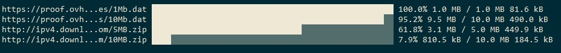

# Multi Threaded Downloader

## Features:
- Multi threaded with `worker_threads` and using WorkerPool.
- Can download multi file.
- Resumable download.
- Segmented download as `Internet Download Manager`, Large files partitioned to segments every segmentt downloaded in parrallel with its worker thread.

---

## Installation:

`npm install fluent-downloader --save`

---

## Declarations:

```typescript
interface Options {
	dir?: string; // The directory to download the files to. default to process.cwd()
	tempDir?: string; // directory to download file parts to, default to `{dir}`
}

interface RemoteFile {
	url: string;
	file?: string;
}

class Downloader extends EventEmitter {
	constructor(options?: Options);

	on(event: 'total', listener: ProgressSummaryListener): this;
	on(event: 'complete', listener: ProgressSummaryListener): this;
	on(event: 'error', listener: ErrorListener): this;
	on(event: 'progress', listener: ProgressListener): this;
	on(event: 'part-progress', listener: PartProgressListener): this;

	get hasErrors(): boolean;
	get error(): string | undefined;
	close(): Promise<void>;
	download(input: string | RemoteFile | (string | RemoteFile)[]): Promise<void>;

	static download(input: string | RemoteFile | (string | RemoteFile)[], options?: Options): Promise<void>;
}

// when not providing file name, the file name will be resolved from the url
instance.download('http://example.com/file.zip');
instance.download({ url: 'http://example.com/file.zip' });
instance.download({ url: 'http://example.com/file.zip', file: 'file.zip' });
instance.download([
	'http://example.com/file.zip',
	'http://example.com/file2.zip',
]);
instance.download([
	{ url: 'http://example.com/file.zip', file: 'file.zip' },
	{ url: 'http://example.com/file2.zip', file: 'file2.zip' },
]);

```

---

## Usage:

### Download single file

```typescript
import { Downloader } from 'fluent-downloader';

async function main() {
	const downloader = new Downloader();
	try {
		await downloader.download("https://proof.ovh.net/files/100Mb.dat");
	} finally {
		// must close downloader to terminate all worker threads used
		await downloader.close();
	}
}

main();
```

---

### Download multi files

```typescript
import { join, parse } from 'path';
import { tmpdir } from 'os';
import { existsSync, mkdirSync } from 'fs';
import { Downloader } from 'fluent-downloader';

async function main() {
	const urls = [
		"https://proof.ovh.net/files/1Mb.dat",
		"https://proof.ovh.net/files/10Mb.dat",
		"http://ipv4.download.thinkbroadband.com/5MB.zip",
		"http://ipv4.download.thinkbroadband.com/10MB.zip",
	];

	const dir = join(__dirname, '/output/');
	if (!existsSync(dir)) mkdirSync(dir);

	const files = urls.map(url => ({ url, file: join(dir, parse(url).base) }));
	const downloader = new Downloader({ dir, tempDir: tmpdir() });
	try {
		await downloader.download(files);
	} finally {
		await downloader.close();
	}
}

main();
```

---

## Examples:
Download multi files with progress as in `examples` dir

clone the repository and use the `examples` dir



---

## Related Projects:
- [@devteks/cursor](https://github.com/mosamuhana/cursor) Hide, show and toggle terminal cursor.
- [@devteks/progress](https://github.com/mosamuhana/node-progress) Node ascii progress bar.
- [@devteks/node-workers](https://github.com/mosamuhana/node-workers) Simple and easy to use worker pool implementation for Node.js.
